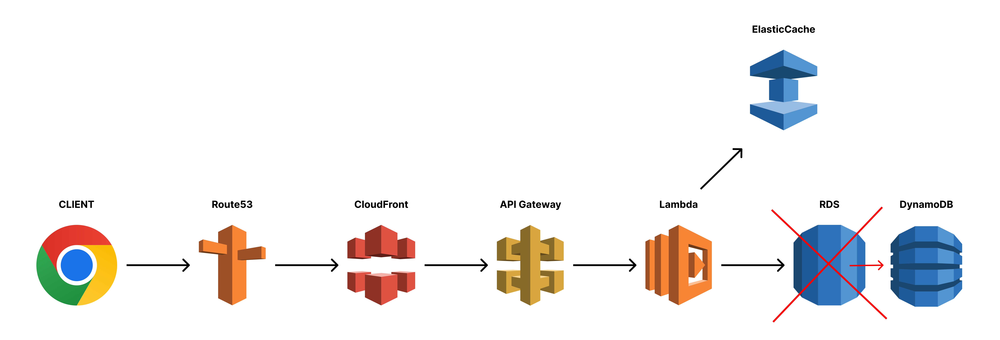
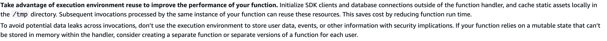

# Caching in Serverless(feat. GraphQL)

## 서버리스란?

- 서버가 없다 X → 개발자가 서버 **관리를 하지 않아도 된다** O
- 특징:
  - **인프라 자동 관리**
    - 오토 스케일링(스케일 아웃만, 리소스는 수동 설정), 다중 AZ 등 내결함성과 고가용성 유지
    - 모니터링 로깅 등 통합 메트릭 제공
    - 보안 관리 자동화 등
  - **Pay Per Use** → 사용한 만큼만 (요청 수, 실행 시간 기준)
  - 경량 실행환경, MSA에 적합 (**Node** ✌️)
  - **Cold Start**:
    - 사용하지 않을 때 인스턴스 **0개**
    - 호출 시점에 **“즉시 생성 + 초기화”**
    - 언어에 따라 다르지만 약 100ms ~ 3000ms
      - VPC 내부 실행 → 게이트웨이 오버헤드
      - Java, .Net 등 → JVM 부팅 오버헤드
    - 방지 (pre-warm-up)
      - Provisoned Concurrency → 인스턴스 미리 준비
      - 주기적 호출 → 항상 따듯한 상태로 유지 (ex: 5분마다 ping)
      - 경량 언어 사용 → **Node** ✌️
- 예시: GCP Cloud Functions, NCP Cloud Functions, AWS Lambda

## 캐싱이란?

- 목적:
  - 성능 향상
  - 비용 절감
- 캐싱 위치:
  - 클라이언트 (브라우저)
  - CDN (cloud front 등의 edge caching)
  - Layer 7 (Nginx, **API Gateway** 등)
  - 서버 어플리케이션 (in-memory)
  - DB 단 캐싱 (PostgreSQL의 Shared Buffer Cache 등의 데이터 블록 캐싱)
- WAS에서의 전통적인 캐시 방식
  - 레디스 딸깍
- 람다에서 캐싱이 중요한 이유
  - Pay Per Use
  - Cold Start

## 그럼 `Serverless`에서는 어디에 캐싱을 해야할까?

- 서버레스가 인터넷과 통신하기 위해서 다음과 같은 옵션들을 선택할 수 있음.
  1. Lambda Function URL (2022년?)
  2. ALB
  3. VPC
     - Lambda (Private Subnet) → NAT Gateway → Internet Gateway → Internet
     - → 오버헤드 발생
  4. API Gateway
     1. Serverless framework 기본 작동 방식

### 캐싱 전략



### Caching at 클라이언트

- 현대 브라우저는 Network 요청을 자동으로 캐싱
  - `Cache-Control` 헤더를 통한 캐싱 정책 설정
  - → But, `Get`, `Head` 요청에 대해서만 → 멱등에 대한 측면
  - → GraphQL은 `Post` 라는 하나의 엔드포인트만을 사용하므로 불가능
  - [Ref: HTTP 캐싱](https://developer.mozilla.org/ko/docs/Web/HTTP/Guides/Caching)

### Caching at Route53

- DNS 캐싱 → 데이터 캐시 X

### Caching at CloudFront

- 엣지 캐싱
  - 서버사이드에서 고려할 수 있는 첫 번째 캐싱
  - 전 세계의 엣지 로케이션에서 정적/동적 컨텐츠 → 로컬 저장
  - 엣지 로케이션: 사용자와 가까운 위치에서의 응답 → 지연 최소화
  - `GET`, `HEAD` 위주 캐싱 (HTML, JS, CSS, 이미지 등)
  - → GraphQL 안되겠지?

### Caching at API Gateway

- 중앙 집중식 API 관리 시스템
  - 트래픽 관리
  - 요청 및 응답 변환
  - CORS
  - 요청 라우팅
  - 캐싱
- 캐싱

  - 자동 설정 X
  - 기본 설정 `GET` only
  - 추가 설정 및 캐시 키에 따라 `POST` 요청도 캐싱 가능 (GraphQL 👍)

    - 기본적으로 cache key 설정으로 body 값 옵션은 X
      → 요청 시 body값을 해시하여 header에 `x-cache-hash` 를 포함하여 캐싱하는 전략
      ```jsx
    const requestBody = {
      query: `
      query ($id: String!) {
      findUserById(id: $id) {
      id
      }
      }
      `,
      variables: {
      id: '1',
      },
      };

          const cacheKey = sha256(body);
          ```

    - 혹은 Serverless를 통한 CloudFormation에 내부 적용

- 코드 및 실습

  ```jsx
  org: hospace
  app: mashup-node

  service: nest-graphql-mercurius-fastify

  plugins:
    - serverless-api-gateway-caching

  custom:
    apiGatewayCaching:
      enabled: true

  provider:
    name: aws
    runtime: nodejs20.x
    region: ap-northeast-2
    environment:
      NODE_ENV: production

  functions:
    main:
      handler: dist/lambda.handler
      events:
        - http:
            path: graphql
            method: POST
            caching:
              enabled: true
              ttlInSeconds: 300
              cacheKeyParameters:
                - name: request.header.Authorization
                - name: integration.request.header.query
                  mappedFrom: 'method.request.body.query'
                - name: integration.request.header.variables
                  mappedFrom: 'method.request.body.variables'
  ```

  - 성능향상
    데이터 1개의 기본적인 쿼리 기준 150ms → 50ms

### Caching at Lambda

- 동일한 Execution Context를 활용하기 위한 모듈 캐싱

  - 요청마다 초기화 작업 → 비효율 초래 → 핸들러 외부에서 초기화한 객체나 연결 재사용 가능
  - 예시1. NestJS 재사용

    ```jsx
    import awsLambdaFastify, {
      LambdaResponse,
      PromiseHandler,
    } from "@fastify/aws-lambda";
    import {
      APIGatewayProxyEvent,
      APIGatewayProxyResult,
      Context,
    } from "aws-lambda";
    import { bootstrapServer, NestApp } from "./main";

    let cachedApp: NestApp;
    let cachedProxy: PromiseHandler<APIGatewayProxyEvent, LambdaResponse>;

    export const handler = async (
      event: APIGatewayProxyEvent,
      context: Context
    ): Promise<APIGatewayProxyResult> => {
      if (!cachedApp) {
        cachedApp = await bootstrapServer();
      }

      if (!cachedProxy) {
        cachedProxy = awsLambdaFastify(cachedApp.instance, {
          decorateRequest: true,
        });
        await cachedApp.instance.ready();
      }
      return cachedProxy(event, context);
    };
    ```

  - 예시2. DB 연결 재사용

    ```jsx
    // db.ts
    import { PrismaClient } from "@prisma/client";

    let prisma: PrismaClient;

    if (!prisma) {
      prisma = new PrismaClient(); // 최초 한 번만 생성
    }

    export { prisma };
    ```

  - 예시3. 정적 자산 (파일 등)
    - lambda 디스크에서는 `/tmp` 경로의 디스크에서만 쓰기 가능
    - nestjs + graphql에서 code-first approach + auto schema 를 사용할 경우 런타임에서 `graphql-schema.gql` 이 생성 → `/tmp` 경로에 캐싱
  - [lambda 공식 문서](https://docs.aws.amazon.com/lambda/latest/dg/best-practices.html#function-code)에서도 `Best Practice` 로써 활용 권장
    

- 어플리케이션 단의 캐싱 (api 요청 캐싱)은 비권장
  - 서비리스 특성
    - 같은 함수라도 여러 인스턴스 동시 존재 가능
    - 인스턴스 재사용 시에만 캐시 유지
    - 인스턴스 간 메모리 공유 불가
    - 라우팅 랜덤 → 같은 IP 여도 같은 인스턴스로 요청한다는 보장이 없음
  - 유의미한 성능 개선 X
  - 보안적인 문제 → 인스턴스가 얼마나 살아있을지 가늠할 수 없음 → 노출 가능성 ↑

### Caching at ElasticCache

- 분산 캐싱 외부 서비스 사용
- VPC 연결 필수
  - ENI 생성, NAT 게이트웨이 연결 등의 오버헤드 증가 → laytency 증가
- uptime
  - 상시 실행중인 환경으로, 서버리스의 지향점과 맞지 않음

### ~~Caching at RDS~~

- ElasticCache와 비슷한 이유로 사용 지양

### Caching At DynamoDB

- 서버리스 DB → lambda와 비슷한 환경
- VPC 필수 X
- DAX (DynamoDB Accelerator)
  - DynamoDB 자체적인 인메모리 캐싱 기능
  - 자동화된 캐싱 계층 제공
    - 따로 관리 필요 X
    - DAX없이도 일부 캐싱을 지원하나, DAX 는 향상된 고급 캐싱 지원
  - 비용추가
  - 쓰기 작업 캐싱 X
  - ~~VPC 써야됨 ㅋㅋ~~

**참고자료**

[GraphQL 캐싱](https://graphql.org/learn/caching/)

[HTTP 캐싱](https://developer.mozilla.org/ko/docs/Web/HTTP/Guides/Caching)

[api gateway 캐싱](https://www.serverless.com/plugins/serverless-api-gateway-caching)

[api gateway 캐싱 라이브러리](https://www.npmjs.com/package/serverless-api-gateway-caching/v/1.4.1)
